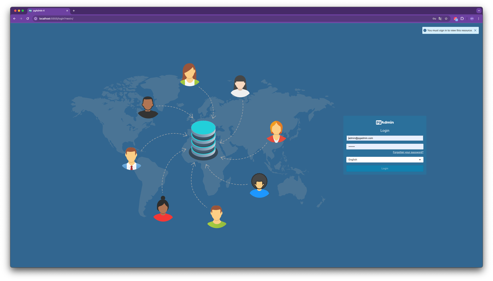
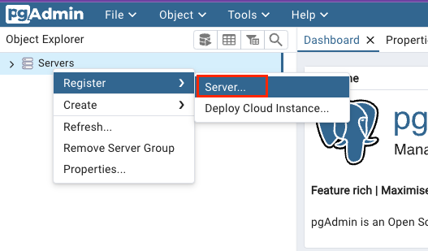
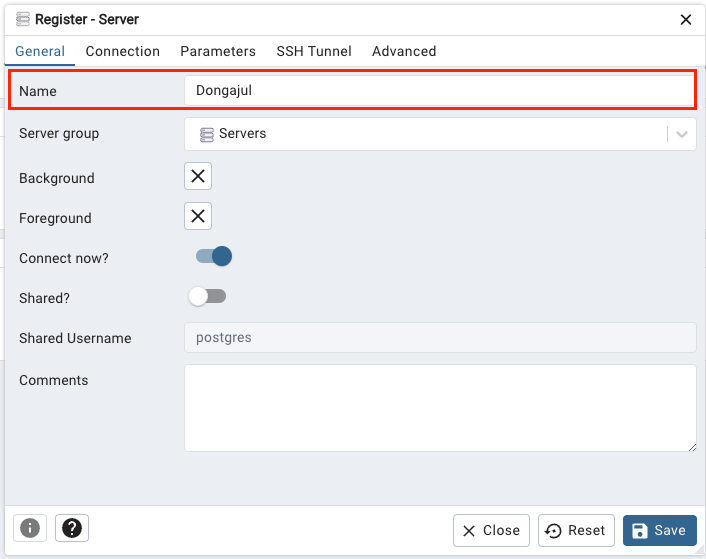
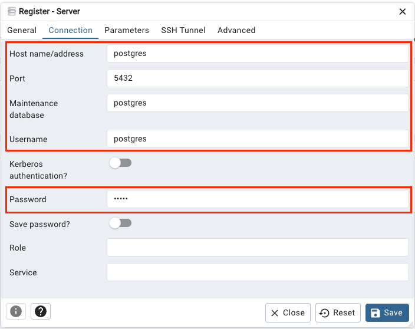
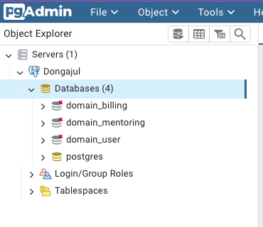

# 프로젝트 사용법

# PostgreSQL for Local Development

1. 루트 프로젝트 경로에서 아래 명령어 실행

    ```shell
    docker-compose up -d
    ```

2. 브라우저 `localhost:5555` 접속

3. PgAdmin 계정 접속 
    - PGADMIN_DEFAULT_EMAIL: admin@pgadmin.com
    - PGADMIN_DEFAULT_PASSWORD: pgadmin

   

4. Server 등록하기

   

5. 서버명 설정 (`General -> Name`)
   - 본인이 원하는 서버명을 자유롭게 입력하면 됩니다.

   

6. 연결 설정 (`Connection`)
   - `Host name/address`: 주소는 도커 컨테이너 호스트명인 `postgres`를 입력합니다.
   - `Port`: 도커 컨테이너에서 매핑한 포트 `5432`를 입력합니다.
   - `Maintenance database`: 메인 접속 디비(`postgres`)를 입력합니다.
   - `Username`: 접속할 계정명을 입력합니다.(`postgres`)
   - `Password`: 접속할 계정의 비밀번호를 입력합니다.(`admin`)
   
   

7. 연결 확인
   - 데이터베이스 목록을 확인하여 미연결된 데이터베이스는 더블클릭하여 접속해줍니다.

   

